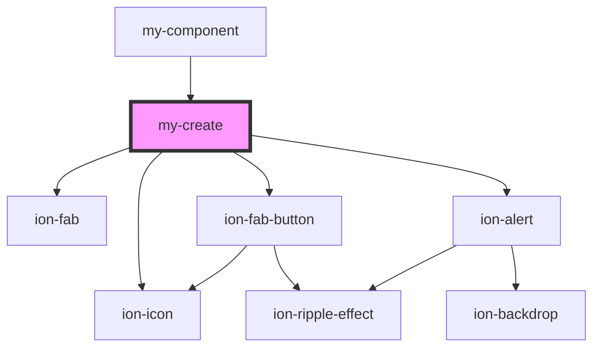

# my-create

<!-- Auto Generated Below -->

## Dependencies

### Used by

 - [my-component](../my-component)

### Depends on

- ion-fab
- ion-fab-button
- ion-icon
- ion-alert

### Graph

----------------------------------------------

*Built with [StencilJS](https://stenciljs.com/)*
