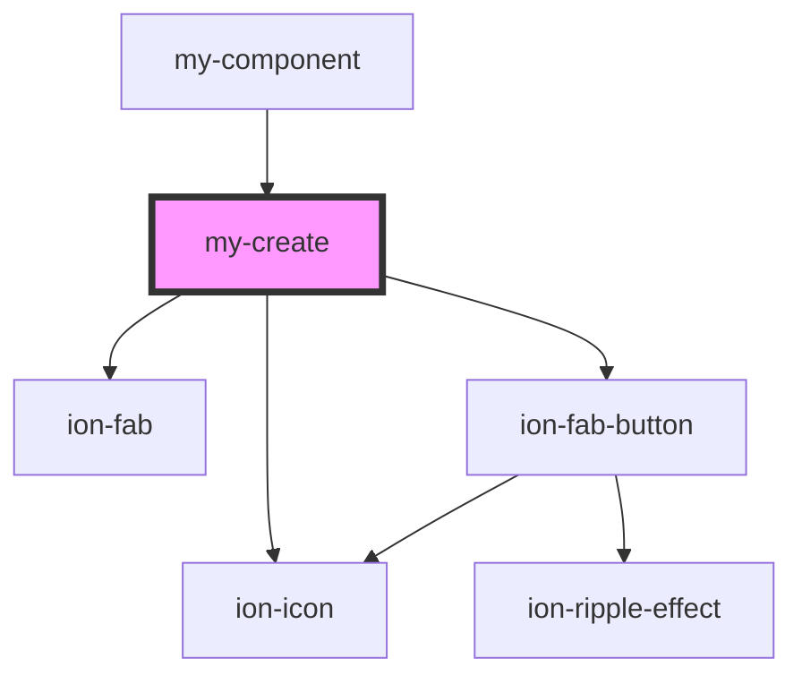

# my-create

<!-- Auto Generated Below -->

## Events

| Event         | Description                        | Type               |
| ------------- | ---------------------------------- | ------------------ |
| `itemCreated` | Fires up when an item got created. | `CustomEvent<any>` |

## Dependencies

### Used by

 - [my-component](../my-component)

### Depends on

- ion-fab
- ion-fab-button
- ion-icon

### Graph

----------------------------------------------

*Built with [StencilJS](https://stenciljs.com/)*
