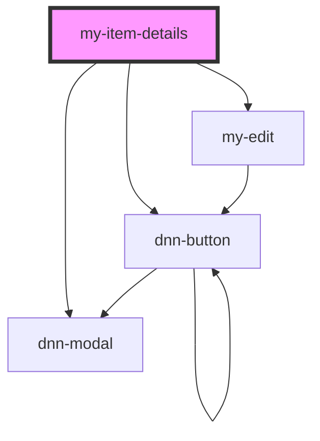

# my-item-details

<!-- Auto Generated Below -->

## Properties

| Property            | Attribute | Description         | Type             | Default     |
| ------------------- | --------- | ------------------- | ---------------- | ----------- |
| `item` _(required)_ | --        | The item to display | `IItemViewModel` | `undefined` |

## Dependencies

### Depends on

- dnn-button
- dnn-modal
- [my-edit](../my-edit)

### Graph

----------------------------------------------

*Built with [StencilJS](https://stenciljs.com/)*
